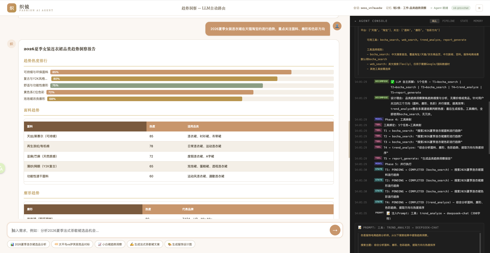
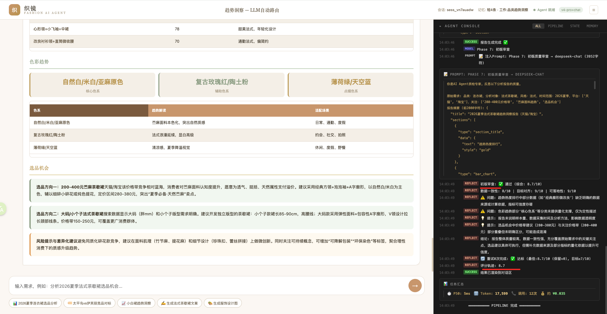
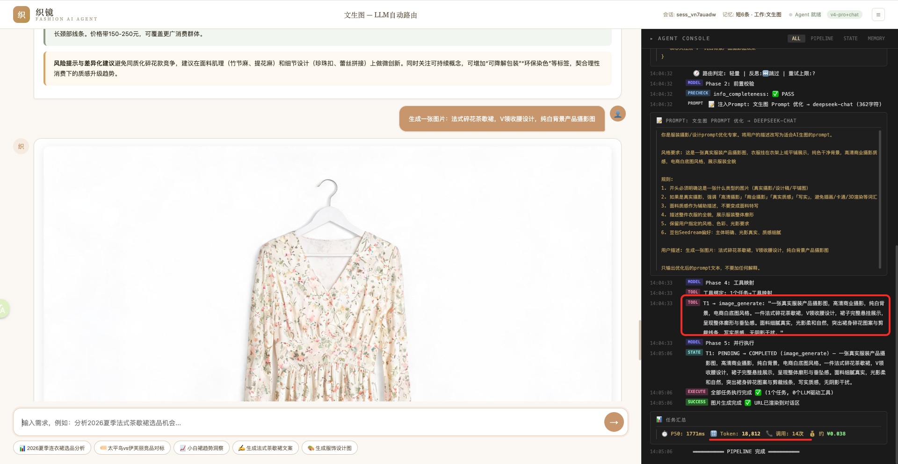

<p align="center">
  <h1 align="center">织镜 ZHÌJÌNG</h1>
  <p align="center"><em>服饰电商 AI Agent — 自然语言驱动的选品分析与竞品对标工具</em></p>
</p>

<p align="center">
  <a href="https://github.com/pmshaw2045-ops/zhijing-agent/blob/main/LICENSE"></a>
  
  
  
</p>

***

## 概述

织镜 ZHÌJÌNG 是一个面向**服饰电商**场景的 AI Agent 产品。输入自然语言描述（如"分析 2026 夏季法式茶歇裙的选品机会"），Agent 自动完成意图识别、DAG 任务拆解、多源搜索、LLM 分析、报告生成、质量审查的全流程。

后端**真实调用 LLM**，不是固定模板的伪 demo。

***

## 快速开始

```bash
# 1. 克隆
git clone https://github.com/pmshaw2045-ops/zhijing-agent.git
cd zhijing-agent

# 2. 配置密钥（支持任意 OpenAI 兼容 API）
cp .env.example .env
# 编辑 .env，至少填入 LLM_API_KEY（详细配置说明见 docs/config_guide.md）

# 3. 安装依赖
pip install -r backend/requirements.txt

# 4. 启动
python3 -m uvicorn backend.server:app --host 0.0.0.0 --port 8899

# 5. 打开浏览器
open http://localhost:8899
```

### Docker

```bash
docker build -t zhijing .
docker run -p 8899:8899 --env-file .env zhijing
```

---

## 测试

```bash
# 单元测试（mock LLM，快速）
make test

# 集成测试（真实调用 LLM API，需要有效密钥）
make test-integration
```

---

## 截图




***

## 架构

```
用户输入 → IntentRouter (意图识别, 模型: flash)
         → PrecheckEngine (信息校验, 规则引擎)
         → DecomposeEngine (DAG 拆解, 模型: pro)
         → ParallelExecutor (并行执行, 30s 超时)
         → ReportBuilder (报告生成, 模型: chat)
         → ReflectionEngine (质量审查, 7 分阈值)
         → SSE 流式返回
```
zhijing-agent/
├── AGENTS.md              项目主文档（AI Agent 入口）
├── backend/               28 模块 / 4,100+ 行
│   ├── agent_engine.py    Pipeline 编排
│   ├── intent_registry.py 意图元数据中心 (SSOT)
│   ├── memory.py          五层记忆系统
│   ├── tools.py           8 个工具实现
│   ├── decompose_engine.py DAG 自主拆解
│   ├── harness/           管道基础设施
│   └── ...
├── frontend/
│   ├── index.html         100 行 HTML 骨架
│   ├── style.css          CSS 设计系统
│   ├── render.js          报告渲染引擎 (9 种组件)
│   ├── sse.js             SSE 流式 + 重试
│   ├── handler.js         SSE 事件处理 + layout
│   └── console.js         Console 日志
├── tests/                 9 文件 / 130 项测试
├── docs/                  文档目录
│   ├── product_summary.md    产品与技术总结
│   ├── production_readiness.md  生产就绪度评估
│   ├── frontend_split_analysis.md  前端拆分分析
│   └── archive/              历史存档
└── .github/workflows/     CI (pytest + ruff)
```

***

## API

 端点                                  | 说明                   |
 ----------------------------------- | -------------------- |
 `GET /`                             | 前端页面                 |
 `POST /api/chat`                    | SSE 流式对话（核心接口）       |
 `GET /api/health`                   | 健康检查                 |
 `GET /api/metrics`                  | Token 用量 / 请求统计      |
 `GET /api/memory/{id}`              | 会话记忆状态               |
 `GET /api/memory/{id}/conversation` | 会话历史                 |
 `GET /docs`                         | OpenAPI / Swagger 文档 |

详见 [AGENTS.md](AGENTS.md) 或直接访问 `http://localhost:8899/docs`。

***

## 协议

MIT License — 详见 [LICENSE](LICENSE)。
