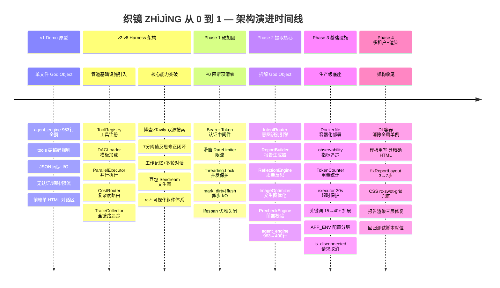

# 织镜 ZHÌJÌNG — 架构演进时间线 (Mermaid)

```mermaid
timeline
    title 织镜 ZHÌJÌNG 从 0 到 1 — 架构演进时间线
    section v1 Demo 原型
        单文件 God Object
        : agent_engine 963行 全揽
        : tools 硬编码规则
        : JSON 同步 I/O
        : 无认证/超时/限流
        : 前端单 HTML 对话区
    section v2-v8 Harness 架构
        管道基础设施引入
        : ToolRegistry 工具注册
        : DAGLoader 模板加载
        : ParallelExecutor 并行执行
        : CostRouter 复杂度路由
        : TraceCollector 全链路追踪
        核心能力突破
        : 博查∤Tavily 双源搜索
        : 7分阈值反思修正闭环
        : 工作记忆+多轮对话
        : 豆包 Seedream 文生图
        : rc-* 可视化组件体系
    section Phase 1 硬加固
        P0 阻断项清零
        : Bearer Token 认证中间件
        : 滑窗 RateLimiter 限流
        : threading.Lock 并发保护
        : mark_dirty∤flush 异步 I/O
        : lifespan 优雅关闭
    section Phase 2 提取核心
        拆解 God Object
        : IntentRouter 意图识别引擎
        : ReportBuilder 报告生成器
        : ReflectionEngine 质量反思
        : ImageOptimizer 文生图优化
        : PrecheckEngine 前置校验
        : agent_engine 963→400行
    section Phase 3 基础设施
        生产级底座
        : Dockerfile 容器化部署
        : observability 指标追踪
        : TokenCounter 用量统计
        : executor 30s 超时保护
        : 关键词 15→40+ 扩展
        : APP_ENV 配置分层
        : is_disconnected 请求取消
    section Phase 4 多租户+渲染
        架构收尾
        : DI 容器 消除全局单例
        : 模板重写 含精确 HTML
        : fixReportLayout 3→7步
        : CSS rc-swot-grid 兜底
        : 报告渲染三层修复
        : 回归测试脚本就位
```
